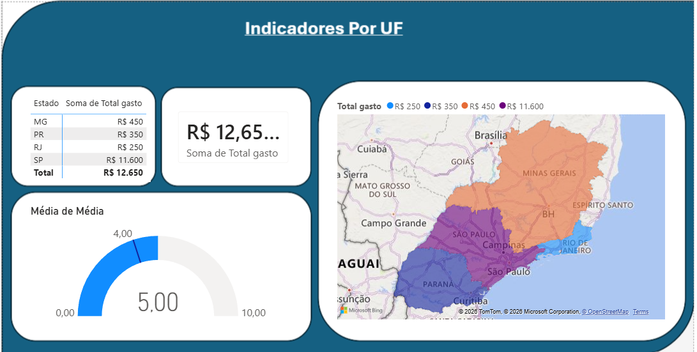

# Projeto_Dashboard_Business_intelligence
Teste de cenário para consolidação de habilidades em SQL e criação de Dashboard no Power B.I, transformando dados em tomadas de decisões. 

# 📊 TechStore Logistics & Sales Performance Dashboard

Análise de Business Intelligence desenvolvida de ponta a ponta, desde a estruturação de consultas e agregações em banco de dados SQL (SQLite) até a visualização analítica e interativa de dados utilizando o Power BI.

---

## 💼 O Problema de Negócio

A diretoria de uma empresa híbrida de tecnologia (venda de produtos físicos e assinaturas) precisava centralizar e analisar os indicadores logísticos e financeiros regionalizados. O objetivo principal era identificar o faturamento bruto gerado por cada Unidade Federativa (UF) e cruzar esses dados com a eficiência de entrega da equipe de logística (tempo médio em dias entre o pedido e a entrega real).

---

## 🛠️ Tecnologias Utilizadas

* **Banco de Dados / Extração:** SQL (Sintaxe SQLite via terminal SQLonline)
* **Engenharia & Tratamento de Dados:** Power Query / ETL
* **Visualização de Dados (BI):** Power BI Desktop
* **Hospedagem & Portfólio:** GitHub

---

## 📐 Fase 1: Inteligência e Agrupamento de Dados (SQL)

Para consolidar as bases relacionais de clientes e pedidos, foi desenvolvida uma consulta mestra utilizando `INNER JOIN` e funções analíticas temporais (`STRFTIME` e `JULIANDAY`). A query abaixo agrupa os dados na origem, otimizando a performance do modelo de BI:

```sql
SELECT 
    clientes_portfolio.estado_cliente, 
    SUM(vendas_produtos.valor_venda) AS Total_gasto, 
    AVG(JULIANDAY(vendas_produtos.data_entrega) - JULIANDAY(vendas_produtos.data_pedido)) AS Media_dias_entrega
FROM clientes_portfolio
INNER JOIN vendas_produtos ON vendas_produtos.id_cliente = clientes_portfolio.id_cliente
GROUP BY clientes_portfolio.estado_cliente;

---

## 🎨 Fase 2: Visualização de Impacto (Power BI)

Aqui é onde transformamos as linhas de código SQL em inteligência de negócios visual e interativa para a tomada de decisão.

Abaixo está o layout final do painel executivo interativo desenvolvido:



### 📈 Os Indicadores na sua Caixa de Ferramentas:
* **Faturamento Global (KPI Card):** Destaca o faturamento acumulado de **R$ 12.650,00**, permitindo que o tomador de decisão saiba o volume total comercializado instantaneamente.
* **Distribuição Geográfica (Mapa Coroplético):** Evidencia visualmente que o estado de **São Paulo (SP)** representa a grande concentração de receita do ecossistema, acumulando **R$ 11.600,00** do total.
* **Eficiência de Envio (Velocímetro / Gauge Chart):** Mede o tempo médio ponderado de entrega (**Média Geral de 5,00 dias**). Esse indicador sinaliza para a gerência de Supply Chain quais estados estão operando dentro do limite estipulado de até 4 dias.

---

## 🚀 Fase 3: Como Executar este Projeto

Para replicar esse ecossistema completo de Business Intelligence na sua máquina, siga o passo a passo abaixo:

### 📋 O Seu Checklist de Execução:
1. **Ambiente SQL:** Baixe o script de criação do banco e população de tabelas inserido na pasta `/sql`. Execute no seu motor SQL (como SQLite) para gerar a base de dados relacional.
2. **Extração Mestra:** Execute a query estruturada na Fase 1 para consolidar os dados e exporte o resultado final em formato **CSV**.
3. **Modelo de BI:** Abra o arquivo `.pbix` na pasta `/dashboard` utilizando o Power BI Desktop, aponte a fonte de dados para o seu novo arquivo CSV e clique em **Atualizar** para carregar os visuais interativos.
